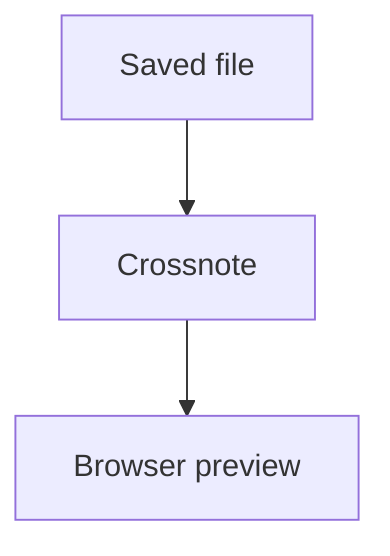

# Tier One Feature Fixture

## GFM Table

| Feature | Status |
|---|---|
| Tables | Ready |
| Task lists | Ready |

## Task List

- [x] Render saved Markdown
- [ ] Export standalone HTML

## Footnote

Footnotes should stay visible in preview.[^note]

[^note]: Tier one footnote content.

## Math

Inline math $x + y$ and block math:

$$
E = mc^2
$$

## Mermaid



## Code

```ts
const phase = 5;
```
